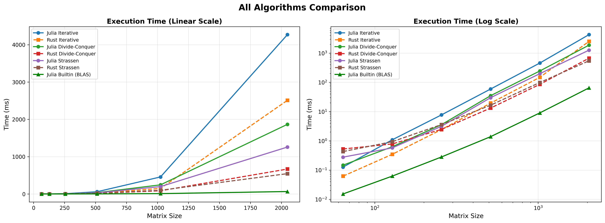
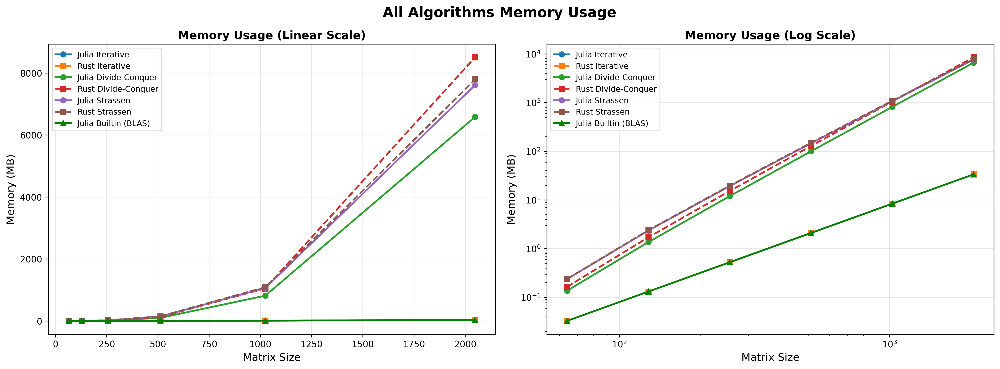

## Uvod

- Množenje matrica je fundamentalna operacija u naučnim i inženjerskim aplikacijama
- Bitna za: mašinsko učenje, numeričke simulacije, obradu signala, računarsku grafiku
- **Julia**: dinamički jezik sa JIT prevođenjem, koristi Garbage Collection, dizajniran za naučna istraživanja
- **Rust**: statički tipiziran jezik sa fokusom na sigurnost i performanse
- **Cilj**: uporediti implementacije algoritama množenja matrica u oba jezika sa fokusom na performansama i lakoći implementacije

## Algoritmi

Analizirani algoritmi:

1. **Iterativni algoritam** - $O(n^3)$
   - Direktna implementacija kroz tri ugnježdene petlje

2. **Zavadi-pa-vladaj** - $O(n^3)$
   - Rekurzivna podela matrice na 8 podmatrica

3. **Štrasenov algoritam** - $O(n^{2.81})$
   - 7 rekurzivnih množenja umesto 8

## Implementacija u Juliji - Iterativni (1/2)

```julia
function iterative_matmul(A::AbstractMatrix{T},
                          B::AbstractMatrix{T}) where T
  m, n = size(A)
  q, p = size(B)

  if n != q
    throw(DimensionMismatch(
      "Matrix dimensions must agree"))
  end

  C = zeros(T, m, p)
```

## Implementacija u Juliji - Iterativni (2/2)

```julia
  # Column major order (cache optimizacija)
  for j in 1:p      # kolona C
    for k in 1:n    # akumulacija
      for i in 1:m  # red C
        C[i, j] += A[i, k] * B[k, j]
      end
    end
  end

  return C
end
```

- Prilagođeno skladištenju po kolonama
- Tip `AbstractMatrix` za fleksibilnost

## Implementacija u Juliji - Zavadi-pa-vladaj (1/2)

```julia
function _divide_conquer_recursive(
    A::AbstractMatrix{T},
    B::AbstractMatrix{T},
    threshold::Int) where T
  m, n = size(A)
  q, p = size(B)

  # Bazni slučaj
  if m <= threshold || n <= threshold ||
     p <= threshold
    return iterative_matmul(A, B)
  end
```

## Implementacija u Juliji - Zavadi-pa-vladaj (2/2)

```julia
  # Podela matrica
  m_half = m ÷ 2; n_half = n ÷ 2; p_half = p ÷ 2
  A11 = @view A[1:m_half, 1:n_half]
  # ... ostale podmatrice

  # Paralelno izvršavanje sa @spawn
  t1 = Threads.@spawn _divide_conquer_recursive(
                         A11, B11, threshold)
  # ... ostali taskovi

  # Kombinovanje rezultata
  C11 = fetch(t1) + fetch(t2)
  # ...
  return [C11 C12; C21 C22]
end
```

## Implementacija u Rustu - Struktura Matrix (1/3)

```rust
#[derive(Clone, Debug)]
pub struct Matrix {
    pub data: Vec<f64>,
    pub rows: usize,
    pub cols: usize,
}

impl Matrix {
    pub fn new(rows: usize, cols: usize) -> Self { ... }
    pub fn random(rows: usize, cols: usize) -> Self { ... }

    pub fn submatrix(&self, row_start: usize,
                     row_end: usize,
                     col_start: usize,
                     col_end: usize) -> Matrix { ... }
```

## Implementacija u Rustu - Struktura Matrix (2/3)

```rust
    pub fn add(&mut self, other: &Matrix)
               -> &mut Self { ... }
    pub fn sub(&mut self, other: &Matrix)
               -> &mut Self { ... }
    pub fn pad(&self, new_rows: usize,
               new_cols: usize) -> Matrix { ... }

    pub fn combine_quadrants(c11: &Matrix,
                             c12: &Matrix,
                             c21: &Matrix,
                             c22: &Matrix) -> Matrix { ... }
}
```

## Implementacija u Rustu - Struktura Matrix (3/3)

```rust
// Indeksiranje: matrix[(row, col)]
impl Index<(usize, usize)> for Matrix {
    type Output = f64;
    fn index(&self, (row, col): (usize, usize))
             -> &Self::Output {
        &self.data[col * self.rows + row]
    }
}

// Mutabilno indeksiranje: matrix[(row, col)] = value
impl IndexMut<(usize, usize)> for Matrix {
    fn index_mut(&mut self, (row, col): (usize, usize))
                 -> &mut Self::Output {
        &mut self.data[col * self.rows + row]
    }
}
```

## Implementacija u Rustu - Zavadi-pa-vladaj (1/2)

```rust
fn divide_conquer_recursive(a: &Matrix,
                            b: &Matrix,
                            threshold: usize)
                            -> Matrix {
  let m = a.rows; let n = a.cols; let p = b.cols;

  if m <= threshold || n <= threshold ||
     p <= threshold {
    return iterative_matmul(a, b);
  }

  // Podela matrica
  let a11 = a.submatrix(0, m_half, 0, n_half);
  // ...
```

## Implementacija u Rustu - Zavadi-pa-vladaj (2/2)

```rust
  // Paralelizacija uz Rayon biblioteku
  let results: Vec<Matrix> = vec![
    (&a11, &b11), (&a12, &b21),
    // ... ostale kombinacije
  ]
  .into_par_iter()
  .map(|(a_sub, b_sub)|
       divide_conquer_recursive(a_sub, b_sub,
                                threshold))
  .collect();

  // Kombinovanje kvadranata
  Matrix::combine_quadrants(&c11, &c12,
                            &c21, &c22)
}
```

## Paralelizacija

**Julia (`Base.Threads`):**

- `@spawn` makro kreira virtuelne niti (taskove)
- Planer dodeljuje taskove sistemskim nitima
- Pogodan za rekurzivne algoritme

**Rust (`Rayon`):**

- Automatsko balansiranje opterećenja
- `.into_par_iter()` za paralelnu iteraciju
- Efikasno upravljanje thread pool-om

## Zašto Rayon, a ne `std::thread`?

**Problem sa `std::thread` za rekurziju:**

- Direktno mapiranje na sistemske niti → veliki overhead
- Duboka rekurzija → prevelik broj niti → pad performansi
- Nema automatskog balansiranja opterećenja

**Rešenja za `std::thread` (komplikuju implementaciju):**

- Ograničiti dubinu paralelizacije (hibridni pristup)
- Implementirati iterativno sa eksplicitnim stekom
- Ručno upravljati sinhronizacijom i spajanjem rezultata

**Zaključak**: Rayon pojednostavljuje implementaciju i pruža bolje performanse

## Metod merenja

**Merenje u Juliji:**

- `BenchmarkTools` biblioteka
- Automatski warmup za JIT prevođenje

**Merenje u Rustu:**

- `std::time` za vreme
- `stats_alloc` za heap memoriju (presretanje alokacija)

## Konfiguracija

- `threshold` = 32 (za zavadi-pa-vladaj i Štrasenov algoritam)
- Veličine matrica: 64, 128, 256, 512, 1024, 2048
- Vreme izvršenja: prosečno od 10 ponavljanja
- Broj sistemskih niti: 8

## Rezultati - Iterativni algoritam

| Veličina | Julia (ms) | Rust (ms) | Julia (MB) | Rust (MB) | Speedup (Julia/Rust) | Memory Ratio (Julia/Rust) |
|----------|------------|-----------|------------|-----------|----------------------|---------------------------|
| 64       | 0.13       | 0.06      | 0.03       | 0.03      | 2.17                 | 1.00                      |
| 128      | 1.09       | 0.33      | 0.13       | 0.13      | 3.30                 | 1.00                      |
| 256      | 7.77       | 2.42      | 0.52       | 0.52      | 3.21                 | 1.00                      |
| 512      | 58.47      | 19.68     | 2.10       | 2.10      | 2.97                 | 1.00                      |
| 1024     | 452.44     | 148.36    | 8.39       | 8.39      | 3.05                 | 1.00                      |
| 2048     | 4377.95    | 2625.01   | 33.56      | 33.55     | 1.67                 | 1.00                      |

**Zaključak**: Rust konstantno ~2-3x brži za iterativni algoritam

## Rezultati - Zavadi-pa-vladaj

| Veličina | Julia (ms) | Rust (ms) | Julia (MB) | Rust (MB) | Speedup (Julia/Rust) | Memory Ratio (Julia/Rust) |
|----------|------------|-----------|------------|-----------|----------------------|---------------------------|
| 64       | 0.16       | 0.53      | 0.17       | 0.26      | 0.30                 | 0.65                      |
| 128      | 0.67       | 0.97      | 1.49       | 2.10      | 0.70                 | 0.71                      |
| 256      | 3.70       | 3.65      | 12.47      | 16.81     | 1.01                 | 0.74                      |
| 512      | 34.51      | 20.17     | 101.91     | 134.48    | 1.71                 | 0.76                      |
| 1024     | 263.68     | 116.01    | 823.11     | 1075.84   | 2.27                 | 0.77                      |
| 2048     | 1963.28    | 884.62    | 6619.86    | 8606.71   | 2.22                 | 0.77                      |

**Zaključak**: Za matrice >256, Rust brži, a Julia troši manje memorije (pogledi)

## Rezultati - Štrasenov algoritam

| Veličina | Julia (ms) | Rust (ms) | Julia (MB) | Rust (MB) | Speedup (Julia/Rust) | Memory Ratio (Julia/Rust) |
|----------|------------|-----------|------------|-----------|----------------------|---------------------------|
| 64       | 0.30       | 0.44      | 0.27       | 0.34      | 0.68                 | 1.26                      |
| 128      | 0.63       | 0.99      | 2.48       | 2.78      | 0.64                 | 1.12                      |
| 256      | 3.35       | 4.48      | 19.73      | 21.17     | 0.75                 | 1.07                      |
| 512      | 30.76      | 22.43     | 147.60     | 154.98    | 1.37                 | 1.05                      |
| 1024     | 189.88     | 122.55    | 1070.14    | 1112.11   | 1.55                 | 1.04                      |
| 2048     | 1413.37    | 754.80    | 7644.75    | 7893.79   | 1.87                 | 1.03                      |

**Zaključak**: Sličan trend kao kod zavadi-pa-vladaj

## Poređenje svih algoritama (vreme izvršenja)

{ width=100% }

## Poređenje svih algoritama (memorija)

{ width=100% }

## Rangiranje performansi

**Julia ugrađen `*` operator sa BLAS rutinama:**

- Najbrži za sve veličine matrica (optimizovano decenijama)
- Primer (2048×2048): ~59 ms vs 1413 ms (Strassen) vs 4378 ms (Iterativni)

**Zaključak**: Za stvarne primene **uvek koristiti ugrađeno množenje** u Juliji

## Zaključak

**Implementacija:**

- Julia nudi jednostavniju implementaciju (ugrađeni tipovi matrica)
- Rust zahteva ručnu implementaciju struktura i operatora

**Performanse:**

- Rust brži za osnovne algoritme (~2x za iterativni)
- Julia troši manje memorije zahvaljujući pogledima (`@view`)
- **BLAS rutine u Juliji su daleko najbrže**

**Preporuka:**

U praksi koristiti ugrađeno množenje matrica u Juliji (`*` operator) koje koristi visoko optimizovane BLAS biblioteke

##

\centering
\huge
Hvala na pažnji!

## Literatura

\footnotesize
